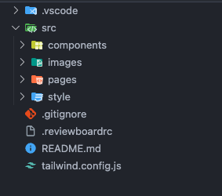

# **`Project Overview`**

This project includes the following pages cloned from Nike website:

1. Home Page
2. Men page
3. Women page
4. Kids page
5. New & Featured page

# **`Figma`**

https://www.figma.com/design/CLG36K2bObZuORiR4SwPk6/NIKE?node-id=18-570&t=x7Jg0gawCYxNHLP1-1

# `Project Goals`

1. Develop a simplified version of [Nike.com](http://nike.com/) featuring 5 key pages, focusing on essential elements such as the header, navigation menu, body, and footer.
2. Implement interactive elements including hover effects, dropdown, and accordion lists for featured products.
3. Ensure basic responsiveness for the demo pages to showcase adaptability across various screen sizes: desktop, tablet, mobile phone, and customized screen sizes to maintain the original website's layout.
4. Include dummy content and images to simulate the appearance of a live website.
5. Implement clickable links in the navigation bar and a hamburger menu icon (on smaller screens) for demonstration purposes.

# Timeline

- Research and Planning: [4/April/2024]
- Design and Development: [6/April/2024] to [30/May/2024]
- Optimization and Documentation: [05/May/2024] to [29/May/2024]
- Deployment: [30/May/2024]

# `Resources`

- HTML - **defines the structure of the content**
- CSS - **determines the style and layout**
- Javascript -  **makes the content interactive**
- Framework - Tailwind CSS :
    - **Include Tailwind Library**: Use the CDN link available on the official Tailwind CSS website.
    - **Add the CDN Link to HTML**: Insert the link inside the **`<head>`** tag of the HTML file.
    - **Tailwind Configuration**: Customize using Tailwind's configuration file and enable first-party plugins (like forms and typography) using the plugins query parameter in the CDN link.

# `Development Process`

## `HTML`

## **Use Semantic Tags**

- **Use semantic tags**: to improve readability of tags ⇒ add opt for semantic HTML elements like **`<section>`**, **`<button>`** tags

## Avoid Inline CSS

⇒ Difficult to maintain : 

- Not reusable across pages, as the CSS rules are confined within a specific HTML page. Thus, we may need to create different CSS rules for different pages
- The inline CSS comes within head section- this may enhance the loading time of the specific page.

### ⇒ Prefer :

Keep styles in external CSS files to ensure maintainability and separation of concerns.

```html
<!-- example -->
<div class="bg-blue-200">Shop</div>
```

## **Proper Tag Closure**

- **Close all tags**: Ensure all HTML tags are properly closed to prevent validation errors.

## `JavaScript`

### **Naming Conventions**

- **Variables and Functions**: Use camelCase (e.g., **`myVariable`**, **`calculateTotal`**).
- **Classes**: Use PascalCase (e.g., **`MyClass`**, **`UserModel`**).

### **Commenting**

- **Inline comments**: Use sparingly to explain specific lines of code.

e.g. 

**`<!-- header section -->`**

**`// Carousel function`**

### **Function Declarations**

- **Named functions**: Use function declarations for better readability.
- **Arrow functions**: Use for concise syntax, especially for anonymous functions.
- **Example**:

### **Modules and Imports/Exports**

- **Use ES6 modules**: Organize code using **`import`** and **`export`**.
- **Example**:

## Components

***⇒ Using custom elements***

- Create custom elements to extend the set of elements available in the browser.
- **Lifecycle Callbacks**: Use **`connectedCallback()`** for setup instead of the constructor.

### Registering a custom element

To make a custom element available in a page, call the define() method of Window.customElements.

### Using a Custom Element

• Implement custom elements in your code.

# `Responsive`

### Screen Size:

**`max-w-1850px`**

### Screen Responsive Design :

using tailwind and add more customize design to fit with the original website’s responsiveness 

**`.sm:bg-white`**

**`.md:grid grid-col`** 

**`.lg:flex`**

Customize : 

**e.g. `min-[1090px]`**

# **`Folder Structure`**




1. **Src (folder)**:
    - Main container directory for organizing all project resources.
- **Images folder** : contain images folder of each pages (remain the same)
    
    → in each sub folders : have images folders that contains the images of its sections
    
- **Pages (sub folder)**:
    - Holds HTML files or templates representing different pages of the website.
        
        ⇒ In each folders have its own javascript files of its page and it will link together in ‘page’.js e.g. **`home.js`**
        
- **Component (sub folder)**:
    - Includes JavaScript files responsible for different functionalities or components that will be use as global components on the website.
    - Use Dynamic Component which making it more convenient to works with other files/pages
- **Style (sub folder)**:
    - Contains CSS files that style various components or sections of the website.
    - Files  **`Style.css`**control the visual appearance and fonts …ensuring consistency in design.
1. **Additional Files**:
    - **`.gitignore`**:
        - Specifies files and directories to exclude from version control, ensuring a clean and focused repository.
    - **`ReadMe.md`**:
        - Provides project documentation, instructions, or details about the project setup, helping developers understand and contribute to the project effectively.
    - **`tailwind.config.js`**:
        - Configuration file for Tailwind CSS, allowing customization of the CSS framework to fit specific project requirements and design preferences.

# **`Git Workflow`**

## **Git-Flow Branching Strategy**

1. **Overview**
    - The team works using Git/Github, with team members creating local repositories and team leaders creating remote repositories. Team leaders assign tasks for completion by team members.
    - **Main Branch**: The primary container for production code. It is the initial branch checked out locally when someone clones the repository, serving as the base for the production release.
    - **Develop Branch**: Branches off from the Main Branch and serves as a backup. It contains the latest work in progress and represents stable code ready for production.
    - **Feature Branches**: Created off the Develop Branch for specific features. Developers work here until the feature is ready to be merged back into Develop. This keeps the main codebase unaffected by ongoing work.
    - **Release Branch**: Created after development work is completed to prepare for a new production release. This branch is for final testing and bug fixes before merging into the Main Branch.
    - **Bug-fix Branch**: Created from the Release Branch to ensure the upcoming release is stable and free from critical issues.
    - **Hot-fix Branch**: Used to solve critical issues or bugs in the live production version.
    

## **Git-Flow Processes and Commands**

1. Git/GitHub:
    
    Remote Repository:
    
    - Creating Issue and choosing label:
        
        ⇒ Feature branch:
        
        - Feature-Issue : issue description.
        - Details : describe about the problem in detail
        
        ⇒ Release branch:
        
        - Release-version : release description.
        - Details : describe about the problem in detail
        
        ⇒ Bug-fix branch:
        
        - Bugfix : issue description
        - Details : describe about the problem in detail
        
        ⇒ Hot-fix branch:
        
        - Hotfix : issue description
        - Details : describe about the problem in detail
    - Workspace setup:
        - Assign the one who work on the issue.
        - Set the situation of the issue.
        - Match the project.
        - After finish, assign the reviewer
        - Make a code review.
    
    <aside>
    💡 Note: Pay attention to all aspects of the issue (title message, detail description, assigner, reviewer, label, project)
    
    </aside>
    
    Local Repository:
    
    - Branching the branch:
        - Name the branch according to the actual problem and what to do with that branch.
        
        ⇒ Feature branch:
        
        - command e.g : git flow feature start nav-bar
            - result of naming : feature/nav-bar
        
        ⇒ Release branch:
        
        - command e.g : git flow release start 1.0
            - result of naming : release/1.0
        
        ⇒ Bug-fix branch:
        
        - command e.g : git flow bugfix start {the actual problem} release/{name of the release branch}
            - result of naming : bugfix/{bugfix branch name}
        
        ⇒ Hot-fix branch:
        
        - command e.g : git flow hotfix start {name of the released version (tag)}, e.g : 1.1
            - result of naming : hotfix/1.1
    
    <aside>
    💡 Note: Everyone should name the branch according to the actual problem and what to do with that branch.
    
    </aside>
    
    - Commit message :
        - Commit branch :
            
            ⇒ feature : { describe about the problem in detail, which part you’ve worked on }
            
            - feature : home-page, add a menu button to navbar of home page.
            
            ⇒ release : { describe about the release version in detail }
            
            - release : release team website version 1.0
            
            ⇒ bugfix : { describe about the bug on the pre-release version }
            
            - bugfix : fixed the bug on pre-release version 1.0, error on register user account.
            
            ⇒ hotfix : { describe about the problem in detail, which part you’ve worked on and fixed }
            
            - hotfix : home-page, quick fix on released version 1.0, error on nav-bar and hero section.
    
    <aside>
    💡 Note: Give a meaningful commit message.
    </aside>
    

## `*TRACKING:*`

[Nike Clone Process](https://www.notion.so/9e047f72fa6e46bfaf749324cad03fec?pvs=21)
